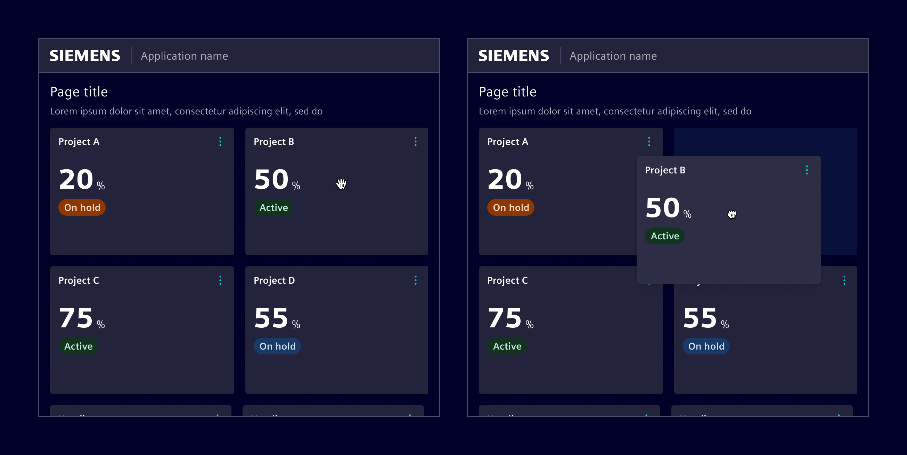
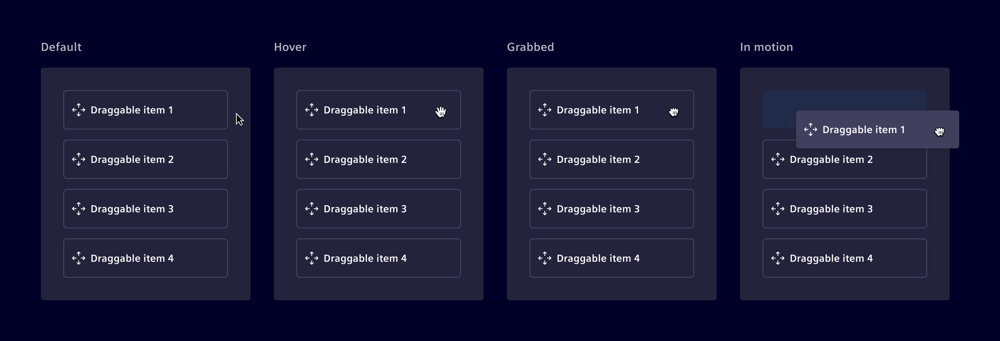
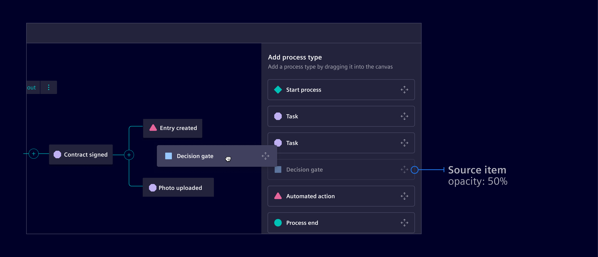
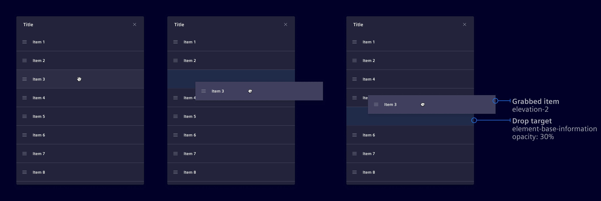
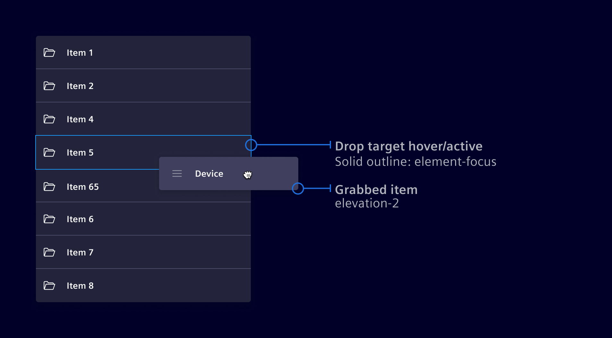
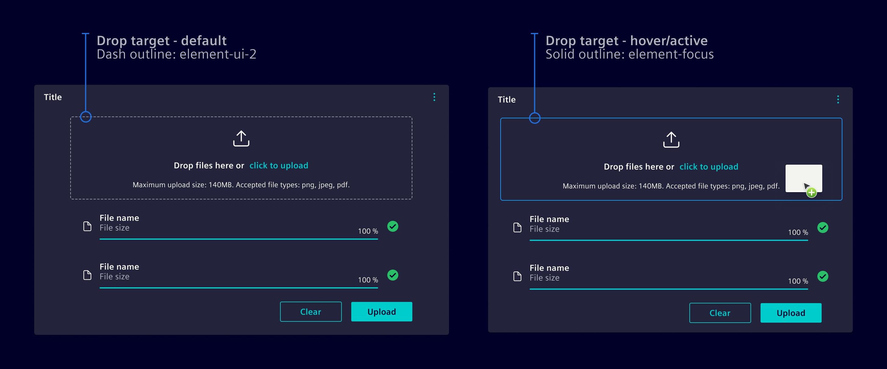
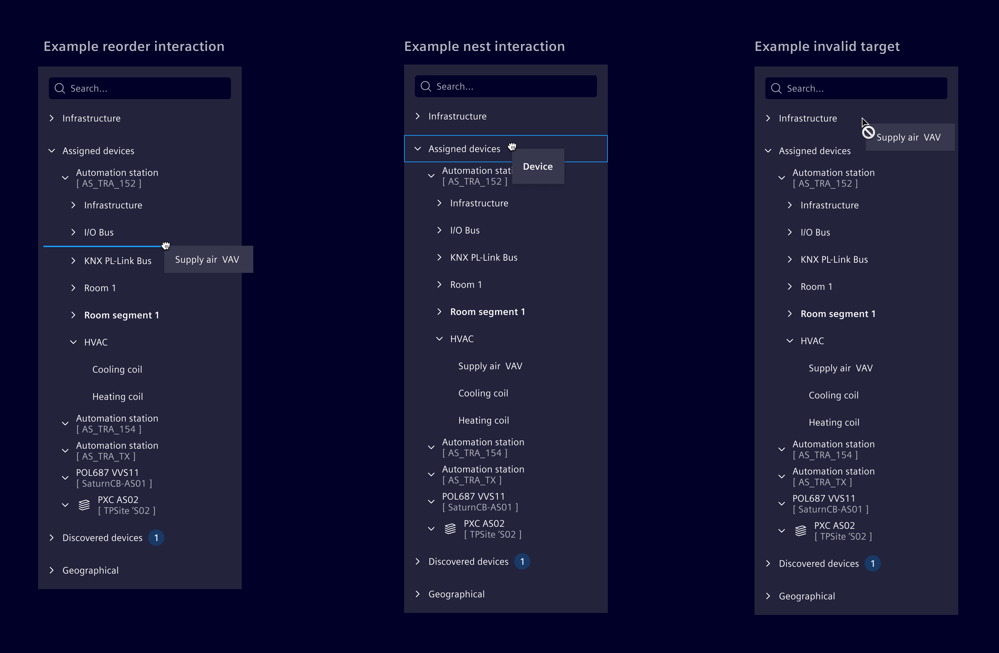
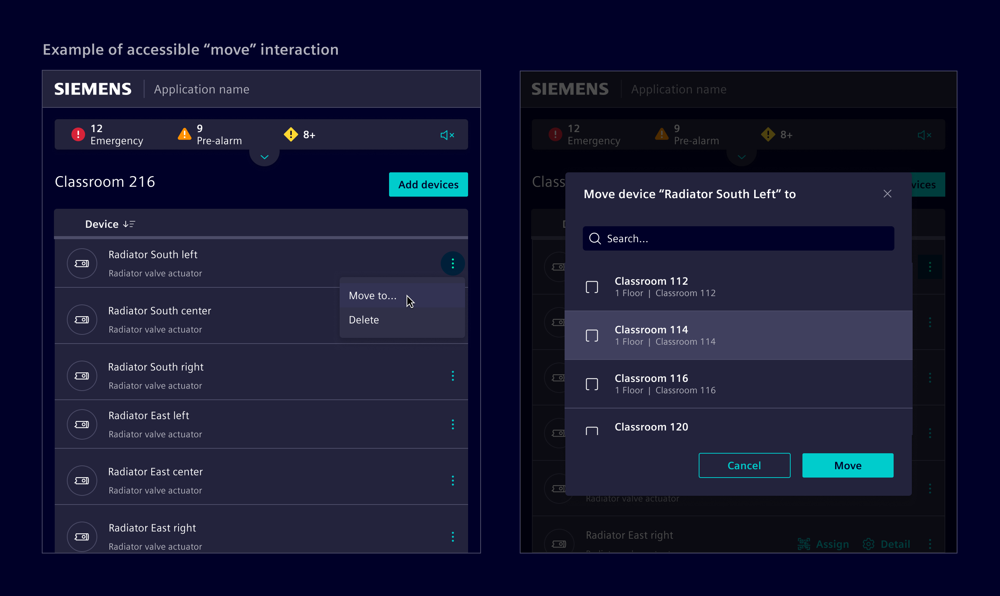

# Drag & drop

**Drag and drop** interactions enable users to select items and dragging them
and dropping them in a different location.

## Usage ---

This interaction allows users to directly manipulate the interface and can be
applied to various use cases, such as reorganizing elements, transferring
objects between areas, or altering the layout.

Drag and drop interactions can be initiated implicitly or explicitly:

- **Implicit drag-and-drop**: The user can directly drag and move an object to a
  desired position.
- **Explicit drag-and drop**: To initiate dragging, the user must first enter an
  edit-mode or navigate to a dedicated setup page. Once this action is completed,
  the user gains the ability to perform CRUD operations (create, read, update,
  and delete).

### When to use

- **Move**: Transferring data between different areas on the screen, such as
  moving or assigning items (e.g. [file uploader](../components/forms-inputs/file-uploader.md)).
- **Reorder**: Reordering items in a list (e.g. [column selection dialog](../components/layout-navigation/modals.md)).
- **Arrange**: To place and size objects in their desired positions on a canvas,
  like graphical editors or [flexible dashboards](../components/dashboards/flexible-dashboards.md).

### Best practices

- Drag-and-drop interactions can be imprecise and inefficient. Consider whether
  this type of interaction is the most suitable for the user's needs.
- Ensure there's a keyboard-accessible alternative to perform the same tasks,
  for users who cannot use a mouse or touch screen.
- Ensure that drop targets are large enough to minimize the need for precise
  movements.
- Keep the dragging distance short.

## Design ---

### Common signifiers

Signifiers are visual cues consistently applied to drag-and-drop interactions.
There are two types of visual signifiers for grabbability: grab-handle icons and
cursor changes.

**Grab handle** icons communicate that drag–and–drop is available and provide a
safe target to click and drag without activating other nearby controls.
**Cursor changes** signal in mouse-driven interfaces that drag–and–drop is
available.

### States

- Default state: The initial state before any interaction begins. Items are
  displayed normally.
- Hover state: Activated when the cursor moves over a draggable item. The cursor
  changes to indicate draggability.
- Grabbed (click and hold): Initiated when the user clicks on the item and holds
  down the mouse button, signaling the intention to drag.
- In motion (dragging): The state when the item is being dragged across the
  screen to a new location. During this state, apply an elevation of 2 to the
  item that's being dragged.

Draggable items can be implicitly (no drag icon) or explicitly (with drag icon)
identified. Add a drag icon when draggability isn't obvious. Avoid it if
draggability is clear or the item is visually complex.

In scenarios where the source of a draggable item should be retained, as in
assigning patterns where an item can be used multiple times, indicate they are
in transition by lowering the opacity of the source item.

### Drop target

The drop target can be either **dynamic** or **static**.

**Dynamic drop** targets adjust according to the item being moved, providing
immediate feedback on its new position.

Dynamic drop targets are utilized in reorder or transferring interactions,
such as in a list. They're also used in placement interactions, for positioning
objects without constraints on a canvas, as seen in graphical editors or
[flexible dashboards](../components/dashboards/flexible-dashboards.md).

**Static drop targets**, featuring a fixed drop area, are primarily utilized in
assigning interactions. These interactions involve linking an object to a
specific property, category, group, or attribute.

In cases with a designated dropzone, such as in a
[file uploader](../components/forms-inputs/file-uploader.md), the predefined
area for receiving items is clearly marked to ensure users can easily identify
the target destination.

#### Drag & Drop in tree

Drag and drop in [tree structures](../components/lists-tables-trees/tree-view.md)
allows users to rearrange or nest nodes. A position marker shows where nodes can
be inserted, and potential parent nodes highlight when they can accept a nested
node.

**Be mindful of these interactions, as they can be imprecise and may lead to conflicts in hierarchy management.**

### Accesibility considerations

**Always provide a keyboard-accessible alternative** to perform the same tasks,
for users who cannot use a mouse or touch screen. Consider implementing
keyboard-navigable context menus offering options like 'Move up', 'Move down',
or 'Assign to', mirroring drag-and-drop interaction capabilities.

Alternatively, implement these interactions using keyboard shortcuts, such as
`ALT+Arrow` keys. To assist screen reader users, provide descriptions of these
shortcuts either through visually hidden text, or by announcing the shortcuts
within the corresponding context menu items.

*Note: Applications will have to implement these accesibility alternatives based on their use case. Element does not provide them by default.*

## Code ---

Element recommends to use Angular CDK's [drag and drop API](https://material.angular.io/cdk/drag-drop/overview)
however there are certain use cases where CDK drag and drop APIs don't
fit. For example:

- **File uploading using drag and drop:**
  In this case we recommend to use our [file uploader](../components/forms-inputs/file-uploader.md)
  component which internally use HTML5 drag and drop API for this purpose.

- **Configurable dashboard widgets:**
  We recommned to use our [flexible dashboard](../components/dashboards/flexible-dashboards.md)
  which is based on [gridstack](https://gridstackjs.com/).

### Usage

#### List

<si-docs-component base="drag-drop" height="550">
  <si-docs-tab example="drag-drop" heading="List"></si-docs-tab>
  <si-docs-tab example="drag-drop-cards" heading="Cards"></si-docs-tab>
</si-docs-component>

#### Tree with different drag and drop use cases

<si-docs-component base="si-tree-view" height="400">
  <si-docs-tab example="si-tree-view-drag-drop-move" heading="Moving between trees"></si-docs-tab>
  <si-docs-tab example="si-tree-view-drag-drop-reorder" heading="Reordering"></si-docs-tab>
  <si-docs-tab example="si-tree-view-drag-drop-assign" heading="Assignment"></si-docs-tab>
</si-docs-component>
