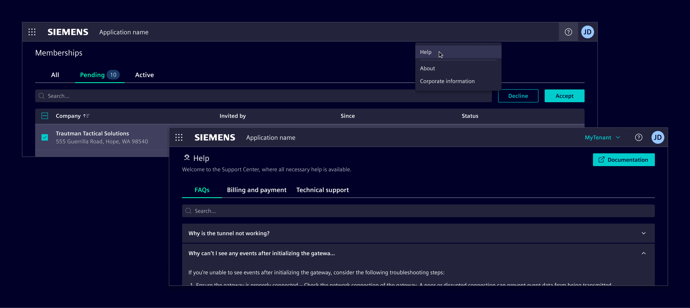
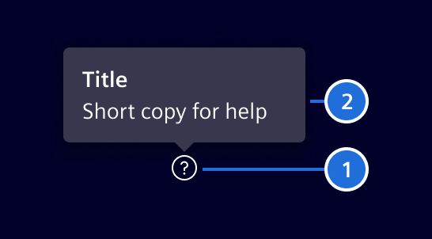

# Help

**Help patterns** provide users with tailored explanations or additional information relevant to their activity within the application.
These patterns are designed to support users as they navigate the system, providing both instant and comprehensive guidance as needed.

## Usage ---

Help patterns should be implemented to assist users in understanding broader concepts,
while allowing them to access more detailed resources if needed.

### When to use

- When help content is essential for completing a specific task.
- When users might find it difficult to understand a feature or process without extra guidance.
- When it’s critical to offer help without disrupting the user’s current workflow.
- When onboarding new users or introducing new features.

### Best practices

- Ensure that help content is directly relevant to what the user is doing.
- Keep help content clear, concise, and digestible.
- Make help options easily accessible within the workflow.
- Design interfaces to be self-explanatory. Use help content only for complex or uncommon tasks.
- Avoid redundant [tooltips](../components/status-notifications/tooltip.md). Use them only for supplementary, non-essential information.

## Design ---

Help patterns should be selected according to the application’s complexity and the user’s needs. Below are some key patterns to consider.

### General help

This type of help provides users with comprehensive resources for deeper learning, such as FAQs or technical documentation.
It's found in the help menu of the [application header](../components/layout-navigation/application-header.md) and
leads users to external help centers or knowledge bases.

### First-time use

Use it for onboarding new users or introducing them to new features.

This pattern uses the [tour](../components/layout-navigation/tour.md), which guides users through the application
or a specific feature step-by-step.
The tour usually highlights key elements of the interface and provides brief instructions or descriptions.

### Contextual help

This provides immediate, on-the-spot assistance via a [help button](../components/buttons-menus/help-button.md).
It’s designed to help users understand specific actions or features on the current page without needing to navigate away.

> 1. Help button, 2. Popover

The content should be short and concise, optionally with [links](../components/buttons-menus/links.md)
to more detailed information available elsewhere, or any other interactive element needed to complete the task.

Contextual help can be embedded in [forms](../components/forms-inputs/forms.md),
typically as part of an input’s label or positioned to the right
of any other element that requires additional explanation (RTL languages).

The popover’s position—top, bottom, left, or right—should be based on the available space around the element.
For accessibility, the popover should be **triggered by user selection** (e.g., clicking or tapping) rather than hovering.
It will remain open until the user moves focus away.

#### Tooltip usage

[Tooltips](../components/status-notifications/tooltip.md) can be used as contextual help but should be limited supplementary, non-essential information.

Their scope is restricted to text only, and they do not support any interactive elements.
They appear on hover and are not accessible on touch devices.
**Only apply tooltips when the information enhances understanding but isn't necessary for completing tasks.**
