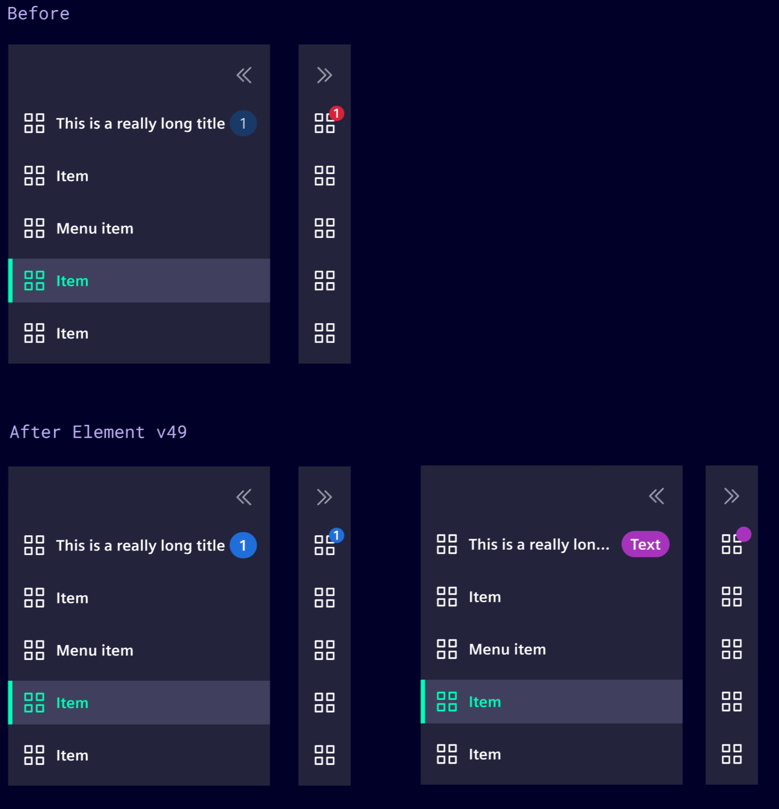
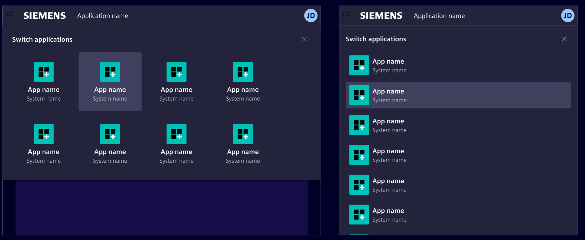
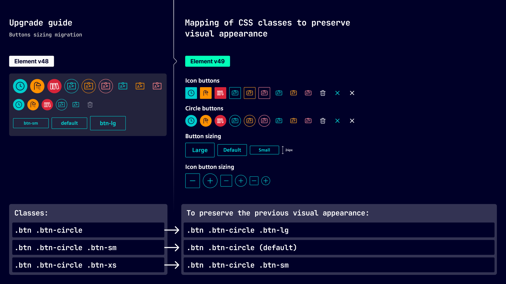
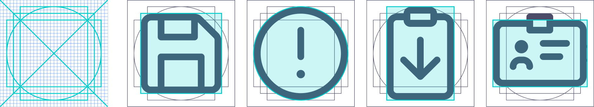

# Welcome Element 49!

We are excited to announce the release of Element 49,
a major step forward toward one [Siemens Design Language (SDL)](https://design-language.siemens.io/).

Highlights of this release include:

- Ongoing Alignment with iX by implementing the SDL
- New open source icons
- Language packs for standard translations (Siemens internal only)
- Support for zoneless change detection

## Visual and behavioral alignment with iX

With Element v49, we continue and deepen the alignment between Element and iX by implementing the SDL,
focusing not only on visual consistency but also on shared interaction patterns
and component behavior.

### New active state and color token refinements

Element v49 introduces a new active state for several interactive components,
including buttons, toggles, and navigation elements, providing clearer and more
consistent visual feedback during user interaction.

### Vertical navbar: badge behavior alignment

The vertical navigation component now features unified badge behavior and visual consistency between both iX and Element.
Badges now maintain their color regardless of the navbar collapsed state.



### Launchpad: visual alignment and responsive improvements

The launchpad component has been updated to match the SDL styling guidelines, including improved responsive behavior on smaller screens.



### Icon buttons: square as the new default

As an alternative to the existing circular icon buttons, a new square variant is now
available via the `.btn-icon` class.

Square icon buttons (`.btn-icon`) are now the recommended default for icon
buttons. Circular icon buttons (`.btn-circle`) remain available and should be
used only when a circular shape is explicitly required.

```html
<!-- Square icon button (new default) -->
<button class="btn btn-icon btn-secondary">
  <si-icon icon="element-search" class="icon" />
</button>

<!-- Circular icon button (use only when circular shape is explicitly required) -->
<button class="btn btn-icon btn-circle btn-secondary">
  <si-icon icon="element-search" class="icon" />
</button>
```

## Button sizing unification

Element v49 standardizes the sizing of all buttons.
This change addresses previous inconsistencies and simplifies
class usage when specifying button sizes.

All button sizes now follow the same specifications:

- Default (`btn`): 32px
- Large (`btn btn-lg`): 40px
- Small (`btn btn-sm`): 24px (reduced from 28px for text buttons)

**Notable changes:**

- The `btn-xs` class has been removed. Use `btn-sm` for 24px buttons.
- Icon and circular buttons now match the heights of regular text buttons.
- Small button sizes have been adjusted to maintain an 8px increment scale (24 → 32 → 40).



## Tooltip: unified interaction pattern

Tooltips have been updated to follow consistent interaction patterns in line
with accessibility guidelines.

Tooltips now always appear on hover and focus, providing better support for keyboard navigation.

## Language packs

Element has many built-in texts that need to be translated.
This includes mostly aria-labels that are invisible, but essential for screen readers.
These texts typically always have context-independent meaning, thus we can provide a default translation.

For Siemens (internal only) we now provide [language packs](https://simpl.code.siemens.io/simpl/best-practices/language-packs/),
shipping default translations for many languages.

## Icons

For almost a year, we've been busy reworking our icons from both technical and
visual perspectives. With Element v49, those efforts have now reached
production-ready state.

### Open sourcing

The most notable change is that almost all Element icons are now available
under an MIT license on [GitHub](https://github.com/siemens/element-icons) and
[npm](https://www.npmjs.com/package/@siemens/element-icons). This allows us to
deeply integrate them into Element again. While in v48 we duplicated some
icons, we now once again have a peer dependency on the Element icons.

Technically speaking, the only change needed is to replace packages and imports.

### New icon grid

We've improved the icon grid to ensure more consistent and predictable results.
The bounding box has been reduced to better fit the actual icon shapes,
eliminate negative margins, and introduce clear scaling logic so icons scale
proportionally across sizes.



Icons are now available with three predefined sizing classes:

- `.icon-sm` (16px): Used in dense UI or compact contexts, such as labels or inline helper actions
- `.icon` (20px): The most common size and pairs well with `body` and `body-bold` text.
- `.icon-lg` (24px): Used for more prominent contexts, such as large buttons, and pairs well with `body-lg` and `body-bold-lg` text.

### SVG icons

As the number of icons grows, so does the file size of the font, which is
currently almost 100 KB for `woff2` (quite large). Yet barely any application
uses all icons, so we needed to find ways for applications to include only a
subset of icons.

In addition, we received requests to provide advanced theming capabilities
beyond overriding class names.

These requirements led us to follow the path of many other icon libraries and
introduce SVG support. The new SVG icons must be used together with the
`<si-icon />` component.

```ts
import { Component } from '@angular/core';
import { elementUser } from '@siemens/element-icons';
import { addIcons, SiIconComponent } from '@siemens/element-ng/icon';

@Component({
  selector: 'app-sample',
  imports: [SiIconComponent],
  template: `<si-icon class="icon" [icon]="icons.elementUser" />`
})
export class SampleComponent {
  // addIcons returns a map of all names added to the library for typesafe use in the template.
  icons = addIcons({ elementUser });
}
```

The icon font including the `element-*` classes will remain available. Unless
needed to meet application size requirements, we currently do not recommend
migrating existing applications.

However, we will update all our documentation and examples to use the new SVG
icons. For new code, we recommend using SVG icons over the classic font
approach.

Read the [icon documentation](https://element.siemens.io/fundamentals/icons/)
for more details checkout our [list of icons](https://element.siemens.io/icons/).

## Finalizing the open source transition

With Element v48, we released our first open source version of Element.
With Element v49, we now completed the transition to open source.

With that, we will no longer release the internal proxies of the open source packages.

This means that

- `@simpl/element-ng`
- `@simpl/element-theme`
- `@simpl/element-translate-ng`
- `@simpl/charts-ng`
- `@simpl/native-charts-ng`
- `@simpl/dashboards-ng`
- `@simpl/maps-ng`

must be removed and replaced with their `@siemens/*` counterparts.

## Housekeeping and technical enhancements

As with every major release, we updated all our dependencies to their latest versions.

This includes:

- Angular v21 is now required
- the deprecated `@angular/animations` is no longer needed by Element
- `@ngx-translate/core@17` is now supported

## Zoneless change detection support

Element v49 now supports [Angular's zoneless](https://angular.dev/guide/zoneless#) change detection,
allowing applications to remove the `zone.js` polyfill and benefit from improved performance and reduced bundle sizes.

## Native federation support for flexible dashboards

Flexible dashboards now support **native federation**.

Three integration modes are now available for loading remote widgets through micro frontend:

| Mode                  | Description                             |
| --------------------- | --------------------------------------- |
| **Module Federation** | Webpack-based federation (existing)     |
| **Native Federation** | ESM-based, bundler-agnostic :sparkles:  |
| **Hybrid/Bridge**     | Native host + Module Federation remotes |

### New entry points

Two new entry points have been added to `@siemens/dashboards-ng`:

- **`/native-federation`** – Use when both your host app and remote widgets use Native Federation (ESM-based). Set `factoryType: 'native-federation'` in your widget descriptor.
- **`/native-federation/mf-bridge`** – Use when your host app uses Native Federation but you need to load existing Webpack-based Module Federation remotes. Set `factoryType: 'native-federation-module-bridge'` in your widget descriptor.

For gradual migration, use the hybrid bridge to load existing Webpack remotes from a Native Federation host.

For more details [Click here](https://github.com/siemens/element/blob/main/projects/dashboards-ng/README.md#remote-widget-loading-microfrontends)

## New charts entry points

`@siemens/charts-ng` is restructured into a modular architecture with separate entry points for each chart component, enabling better tree-shaking and improved performance.

```ts
// Before
import { SiSankeyChartComponent } from '@siemens/charts-ng';

// After
import { SiSankeyChartComponent } from '@siemens/charts-ng/sankey';
import { SiGaugeChartComponent } from '@siemens/charts-ng/gauge';
```

**Available Entry Points:**

- **Chart components**: `cartesian`, `circle`, `chart`, `gauge`, `progress`, `progress-bar`, `sankey`, `sunburst`
- **Shared modules**: `common`, `custom-legend`, `loading-spinner`

Update your imports to the specific entry points to take advantage of reduced bundle sizes. The `SiChartsNgModule` is now deprecated in favor of modular imports.

## Beyond Element v49

Element v49 is a major milestone in our journey towards one Siemens Design Language (SDL).
But we are not stopping here.
We will continue to work closely with iX and align our Design Systems to become one unified SDL.

Thank you all for using Element and helping us with your feedback and contributions that made Element one of the major
Design Systems at Siemens.
