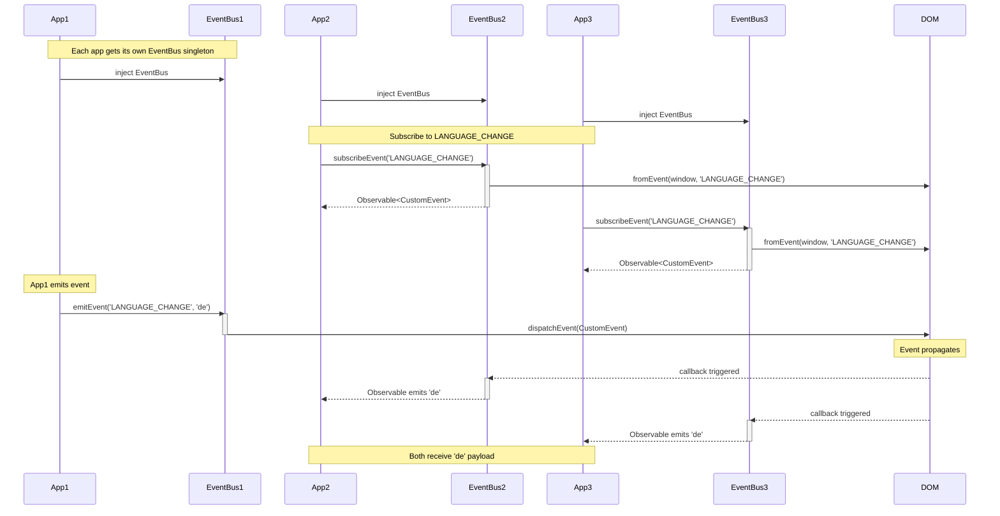

# EventBus Service - Sequence Diagram

## Flow Description

1. **Injection Phase**: Each application (App1, App2, App3) injects the `EventBus` service. Since they are separate apps, each receives its own singleton instance.

2. **Subscription Phase**:
   - App2 and App3 call `subscribeEvent('LANGUAGE_CHANGE')`
   - EventBus internally uses RxJS `fromEvent()` to listen for CustomEvents on the window
   - Returns an Observable to the subscribing app

3. **Emit Phase**:
   - App1 calls `emitEvent('LANGUAGE_CHANGE', 'de')`
   - EventBus dispatches a `CustomEvent` with the event name and payload

4. **Event Propagation**:
   - The CustomEvent triggers callbacks on all EventBus instances listening via `fromEvent`
   - Each EventBus emits the payload through its Observable
   - App2 and App3 both receive the `'de'` payload
